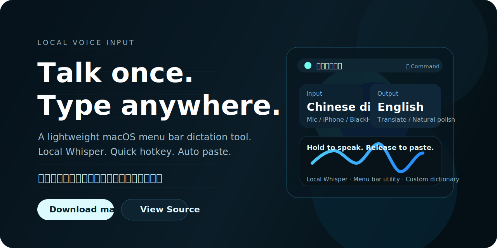

# Local Voice Input / 本地语音输入



[](https://github.com/mashengsbc-beep/local-voice-input/releases/tag/v2.6.0)
[](https://github.com/mashengsbc-beep/local-voice-input)
[](./LICENSE)

A compact macOS menu bar voice input tool powered by local Whisper.

一款更接近“语音输入法”的 macOS 菜单栏工具：本地录音、本地转写、尽量自动回填输入框。

## Links

- [Download macOS zip](https://github.com/mashengsbc-beep/local-voice-input/releases/download/v2.6.0/local-voice-input-macos-v2.6.0.zip)
- [Release notes](https://github.com/mashengsbc-beep/local-voice-input/releases/tag/v2.6.0)
- [Project site](https://mashengsbc-beep.github.io/local-voice-input/)

## English

### What it is

- Lightweight macOS menu bar app
- Hold a hotkey to talk, release to transcribe
- Local Whisper models: `tiny`, `base`, `small`
- Original transcription, English translation, and natural English polish
- Simplified Chinese and Traditional Chinese output
- Switchable audio input sources
- Custom replacement dictionary for names, brands, and recurring fixes

### Quick start

Install dependencies:

```bash
python3 -m venv .venv
source .venv/bin/activate
pip install -r requirements.txt
```

Build:

```bash
python build_voice_input_swift_app.py
```

Build and install into `/Applications`:

```bash
python build_voice_input_swift_app.py --install
```

Build, install, and create a release zip:

```bash
python build_voice_input_swift_app.py --install --zip
```

If your Python is not stored in `.venv`:

```bash
LOCAL_VOICE_INPUT_PYTHON=/path/to/python python build_voice_input_swift_app.py --install
```

### Use

1. Open the app.
2. Click the text field you want to type into.
3. Hold the configured hotkey to start recording.
4. Release the hotkey to stop and transcribe.
5. The result is copied to the clipboard and the app will try to paste it back automatically.

You can also left-click the menu bar icon to start and stop manually.

### Permissions

- `Privacy & Security -> Microphone`
- `Privacy & Security -> Accessibility`
- `Privacy & Security -> Input Monitoring` if your hotkey setup needs it

### Output modes

- `Original transcription`
- `Translate to English`
- `Natural English polish`

### Audio input sources

- Built-in microphone
- Earbuds / headset microphone
- Third-party USB microphone
- iPhone microphone
- Virtual audio devices such as BlackHole or Loopback

### Custom dictionary

Use the app's `Open Custom Dictionary` action.

Path:

```text
~/Library/Application Support/local-voice-input/custom_dictionary.txt
```

Format:

```text
wrong text => desired text
```

Example:

```text
open ai => OpenAI
閃電說 => 闪电说
```

## 中文

### 这是什么

- 一个轻量的 macOS 菜单栏语音输入工具
- 长按热键开始说话，松开后自动转写
- 使用本地 Whisper 模型：`tiny`、`base`、`small`
- 支持原文转写、翻译成英文、自然英文润色
- 支持简体中文和繁體中文输出
- 支持切换语音输入源
- 支持自定义词库，方便修正人名、品牌名和常见错别字

### 快速开始

安装依赖：

```bash
python3 -m venv .venv
source .venv/bin/activate
pip install -r requirements.txt
```

构建：

```bash
python build_voice_input_swift_app.py
```

构建并安装到 `/Applications`：

```bash
python build_voice_input_swift_app.py --install
```

构建、安装并打一个 zip 发布包：

```bash
python build_voice_input_swift_app.py --install --zip
```

如果你的 Python 不在 `.venv`：

```bash
LOCAL_VOICE_INPUT_PYTHON=/path/to/python python build_voice_input_swift_app.py --install
```

### 使用方式

1. 打开 app。
2. 先点一下你要输入文字的输入框。
3. 长按热键开始说话。
4. 松开热键后会结束录音并开始转写。
5. 结果会先写入剪贴板，并尽量自动粘贴回刚才的输入框。

也可以直接左键点菜单栏图标，手动开始 / 结束录音。

### 权限

- `隐私与安全性 -> 麦克风`
- `隐私与安全性 -> 辅助功能`
- 如果热键还需要，也可以打开 `隐私与安全性 -> 输入监控`

### 输出模式

- `原文转写`
- `翻译成英文`
- `自然英文润色`

### 输入源

- 内置麦克风
- 耳机 / 蓝牙耳机麦克风
- 第三方 USB 麦克风
- iPhone 麦克风
- BlackHole、Loopback 之类的虚拟音频设备

### 自定义词库

菜单栏 app 里点 `打开自定义词库`，会编辑这个文件：

```text
~/Library/Application Support/local-voice-input/custom_dictionary.txt
```

格式：

```text
识别结果 => 你想要的文字
```

例如：

```text
open ai => OpenAI
閃電說 => 闪电说
```

## Project layout / 仓库结构

- `swift_voice_input_app.swift`: native macOS menu bar app
- `voice_input_core.py`: audio device handling and local Whisper backend
- `voice_input_audio_cli.py`: device listing and recording helper
- `voice_input_transcribe_cli.py`: transcription / translation CLI
- `build_voice_input_swift_app.py`: build, install, and zip script
- `docs/`: lightweight landing page for GitHub Pages

## Notes / 说明

- This repository is source-first. The app bundle records the Python path used at build time, so the most reliable path is to build locally on the target Mac.
- By default the build is unsigned. Use `--sign` only if you already have a local macOS signing identity.
- Whisper translation uses the local `translate` task built into Whisper.
- 当前项目主要面向 macOS。
